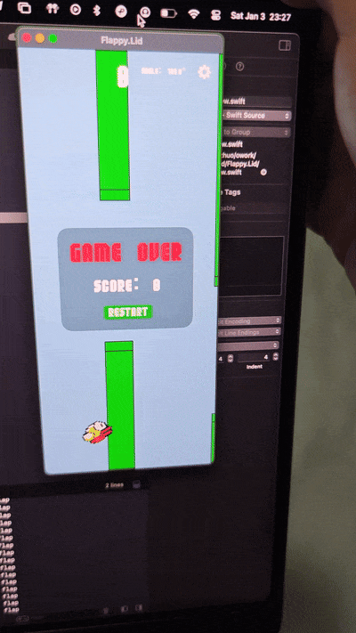
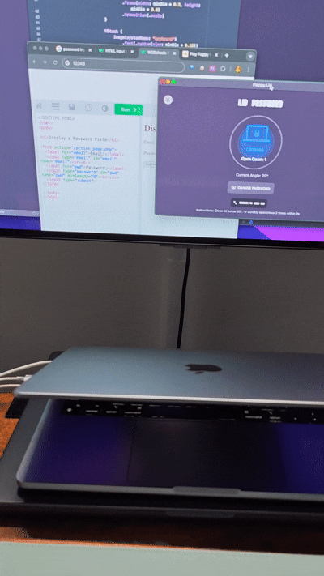

  
  <h1>💻 Flippy Lid 🦅</h1>
  

    <strong>The first productivity tool powered by your hinge!</strong> 
    Built with <strong>SwiftUI</strong> + <strong>Private IOKit Sensors</strong> + <strong>Pure Chaos</strong>
  

  

    
    
    
  

---

### 🧐 What is this sorcery?

**Flippy Lid** turns your MacBook's lid into a physical input controller. Yes, really. 

By tapping into the hidden `AppleCLCD` hinge angle sensors (via some dark IOKit magic 🧙‍♂️), we detect when you open or close your laptop. We then translate those physical "flaps" into digital actions.

It's the only app that gives your hinge a workout while you procrastinate.

---

### 🎮 Features

#### 1. FLAPPY GAME
The classic game, but you control the bird by **physically flapping your MacBook screen**. 
*   **Open Lid** = Flap Up
*   **Risk Level**: High (Please don't snap your screen)

#### 2. KEY SIMULATOR (Universal Controller)
Map your lid "flaps" to **ANY keyboard key**.
*   Map it to **Space** -> Play Chrome's Dinosaur Game physically.
*   Map it to **W** -> Walk forward in games by oscillating your screen.
*   The possibilities are endless (and ridiculous).

#### 3. LID PASSWORD (James Bond Mode)
Automatically type a preset password when you perform a secret "Lid Handshake".
*   **Trigger**: Quickly open/close your lid 3 times.
*   **Action**: Type the preset password in any input box.
*   **Cool Factor**: 11/10 when done in a coffee shop.

---

### 💡 The "Science"

This project stands on the shoulders of giants (and reverse engineers):

*   **The Sensor**: MacBooks have Hall Effect sensors or similar mechanisms to detect lid angle for sleep/wake. We read the raw data from `IOHIDDevice`.
*   **The Pioneer**: [LidAngleSensor](https://github.com/samhenrigold/LidAngleSensor) by **Sam Henri Gold**. He did the hard work of finding the magic IOKit keys.
*   **The Spark**: Directed by [this tweet](https://x.com/rebane2001/status/2007198231479103611) from **@rebane2001**, who wisely asked: *"Can I jump by closing my laptop?"*

---

### ⚠️ Warning: Read Before Flapping

> [!WARNING]
> **USE AT YOUR OWN RISK.**

1.  **Hinge Health**: Your MacBook hinge is designed for gentle adjustments, not high-frequency flapping. We are not responsible if your screen becomes floppy.
2.  **Social Awkwardness**: Using this app in public **will** make people stare at you. Embrace it.
3.  **Compatibility**: 
    *   **ARM Macs Only**: Specifically designed for M1/M2/M3 MacBooks. Intel Macs use different sensors (and are too hot to touch anyway).
    *   **Private APIs**: We use private APIs. Apple could patch this loophole at any moment. Enjoy it while it lasts!

---

### 🚀 How to Run

1.  **Clone** this repository.
2.  Open `Flappy.Lid.xcodeproj` in **Xcode**.
3.  **Build & Run**.
4.  Grant **Accessibility Permissions** (needed for Key Simulation).
5.  Start flapping! 🦅

---

  Made with ❤️ and questionable judgment by Lizhuo

